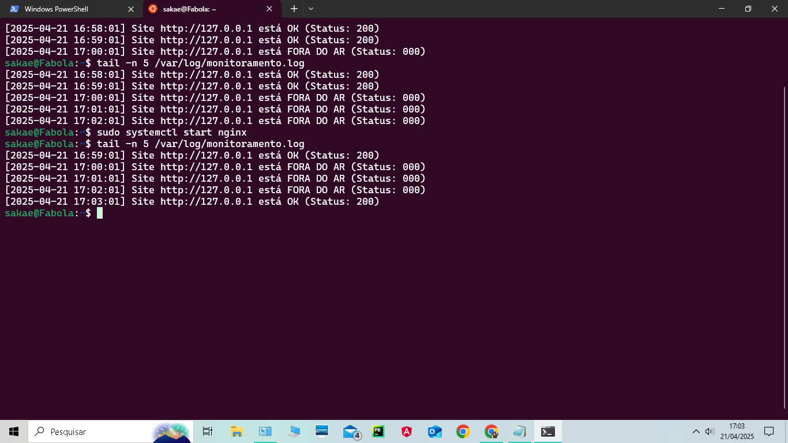
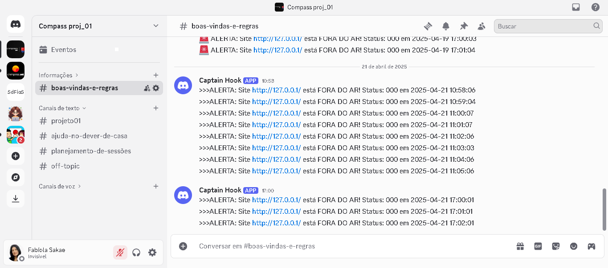

# Projeto Linux Compass

Este é um projeto de monitoramento de sites desenvolvido como parte de um curso de DevSecOps. O objetivo é monitorar a disponibilidade de um site local e enviar notificações via Discord quando ele está fora do ar.

## Funcionalidades
- **Monitoramento de Site**: Um script Bash (`monitor_site.sh`) verifica a cada minuto se o site `http://127.0.0.1` está disponível.
- **Notificações no Discord**: Quando o site está fora do ar, uma notificação é enviada para o canal `#boas-vindas-e-regras` no Discord.
- **Página Web**: Uma página HTML estilizada (`index.html`) é hospedada no Nginx para testes, com um fundo de montanha nevada e design moderno.

## Estrutura do Projeto
- `monitor_site.sh`: Script de monitoramento.
- `index.html`: Página web de teste.
- `crontab.txt`: Configuração do cron para agendamento.
- `nginx-default.conf`: Configuração do Nginx.

## Como Executar
1. Configure o Nginx e coloque o `index.html` em `/var/www/tkg/`.
2. Copie o `monitor_site.sh` para `/opt/scripts/` e ajuste as permissões.
3. Configure o cron para executar o script a cada minuto.
4. Crie um webhook no Discord e configure a variável `DISCORD_WEBHOOK_URL` no script wrapper `run_monitor_site.sh`.

## Capturas de Tela
- **Log de Monitoramento**:
  
- **Notificação no Discord**:
  
